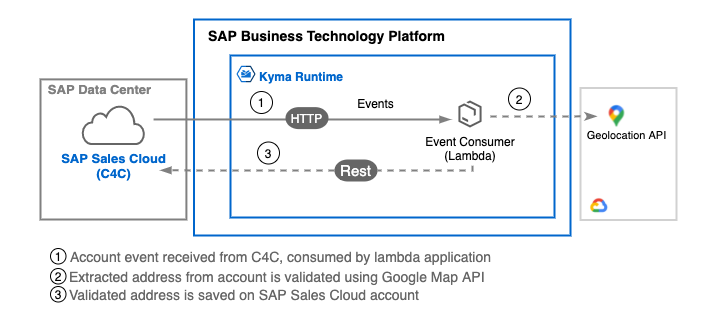

# SAP Sales Cloud Extension - Account address verification
Welcome to the SAP Business Technology Platform "SAP Sales Cloud Extension" use case PoC.

## Description
SAP Sales Cloud Account address verification, a cloud-based solution, act as an extension of SAP Sales Cloud,
running on the <b>SAP Business Technology Platform</b>. It uses <b>SAP Kyma Runtime</b> and is powered by Kyma serverless 
functions and event-based communication.

It's receiving SAP Sales Cloud events for accounts operations, extracting and doing verification for account address, 
by using Google Map API, and updating back to the system the correct address including as well address geo-location. 

## Design Architecture Diagrams

## Guidelines

* [SAP Sales Cloud integration with BTP](./setup).
* [Components Deployments](./deployments)

## Known Issues
No known issues at this moment.

## How to obtain support

[Create an issue](https://github.com/SAP-samples/sales-cloud-extension-address-verification/issues) in this repository if you find
a bug or have questions about the content.

## Contributing
In case you want to add some changes then your contributions are welcome in the form of pull requests (PRs) -
please submit in the normal way. Thank you!

## License
Copyright (c) 2021 SAP SE or an SAP affiliate company. All rights reserved. This project is licensed under the
Apache Software License, version 2.0 except as noted otherwise in the [LICENSE](LICENSES/Apache-2.0.txt) file.
