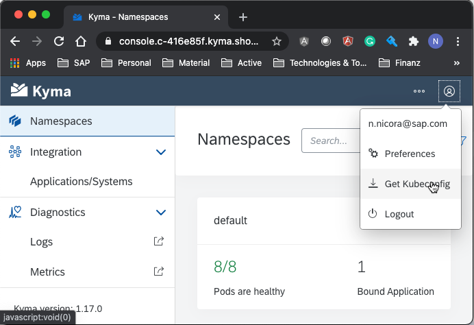

# Kyma Deployments

- You have kubectl available on your machine
- KUBECONFIG environment variable is pointing to K8S configuration file, which can be downloaded
  from Kyma Console/Cockpit, see the screenshot <code>Get Kubeconfig</code>:
  
  

## Preparation

For deployment K8S manifest files can be found from the
[repo](https://github.com/SAP-samples/sales-cloud-extension-address-verification/tree/main/deployment).

Clone the repository:
```sh
git clone https://github.com/SAP-samples/sales-cloud-extension-address-verification.git

cd sales-cloud-extension-address-verification
```

Apply Secrets for Docker Images Repo, will be used to get the images of use case modules.
```sh
kubect apply -n default -f ./prep/
```

## Google Maps API Key

You need a Google account, and make sure that you enable "Geocoding API" under your Google account.

GOOGLE_API_KEY can be retrieved through a registration as described here: 
https://developers.google.com/maps/documentation/geocoding/get-api-key

Collect the Google API Key, and replace content of <code>100-c4c-address-verification-sec.yaml</code> files 
with following:
```sh
apiVersion: v1
kind: Secret
metadata:
  labels:
    app: c4c-address-verification
  name: c4c-address-verification-secret
type: Opaque
data:
  GOOGLE_API_KEY: <REQUIRED: Base64 encoded Google API Key> 
```

## Kyma Lambda Function

Install Kyma Lambda Function as service.

```sh
kubect apply -n default -f ./
```
